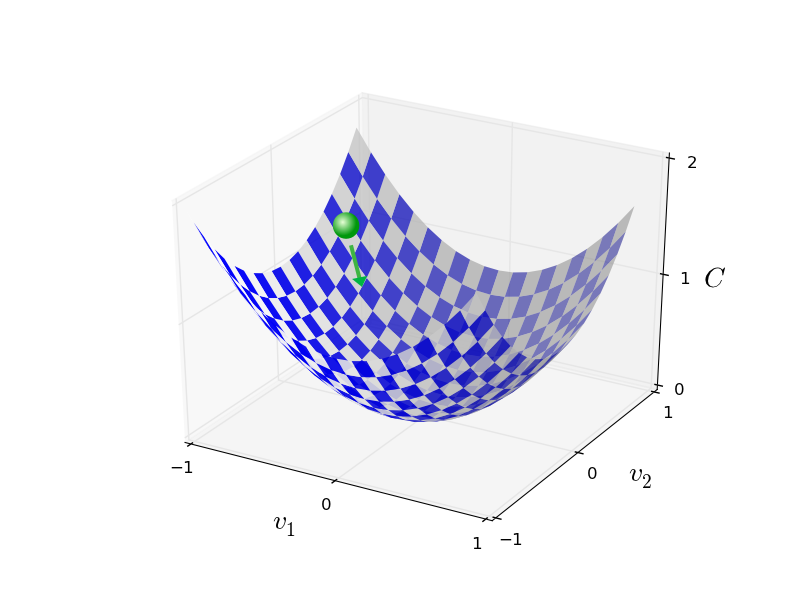

## 梯度下降

现在，我们有了一个神经网络的设计，那么这个神经网络是如何学习识别图像中的数字呢？第一件事情，我们需要一个数据集来进行我们的实验，使用这个数据集来训练我们的神经网络，让他能够学习去识别手写数字，这个数据集被称为训练集。我们将使用MNIST数据集，它包含有上万个手写数字的扫面图像，MNIST这个名字的由来是因为他是两个NIST提供的数据集的修改的子集，NIST是 united states national institute of standards and technology.下面是一些MNIST的样本：


你可能会发现了，这些数字实际上就是我们在上文中展示的数据。不过请放心，在最后我们用来测试神经网络的时候绝对不会使用和训练数据有重叠的数据的。

MNIST数据由两部分组成，第一部分包含有60000个图片是训练集。这些图片是扫描了250个人的手写数字，其中，一半的人在US Census Bureau工作，另一半是高中生。这些图片都是28\*28个像素点的灰度图片。第二部分是10000个测试图片，同样，也是28*28像素的灰度图片。我们会使用测试集来验证我们的神经网络的对于手写数字是别的好坏。为了对神经网络的表现做出一个好的测试，测试数据的来源是250个和写训练数据不一样的人（不过还是两组人一组是census bureau的员工还有高中生）。这可以让我们相信我们的系统可以识别出手写数字，而不是仅仅学会了识别这几个人写的数字。

我们将使用x来标记训练的输入数据，把每一个训练数据的输入x看做一个28*28=784维的向量是很方便的。向量中的每一项都代表图像中的每一个像素点的灰度。我们将期望的正确的输出标记为$y=y(x)，y$是一个10维的向量。举个栗子对于一个特定的训练图像，x，画了一个6，那么输出$y(x)=(0,0,0,0,0,0,1,0,0,0)^T$就是我们期望从这个网络得到的输出。其中的T表示转置，就是把一个行向量变成一个列向量。

我们所期望的是有一个算法可以让我们找到合适的权重和偏移量，使得网络对于每一个训练输入x都可以有近似于y(x)的输出。为了衡量我们的网络的效果（这里就是识别手写数字的准确程度），我们定义了一个代价函数（有些时候会被称为缺失函数或者公正函数，我们在本书中称其为代价函数，但是你需要知道别人不一定这么叫，因为这个东西经常在一些paper中出现，但是名字可能不尽相同）：
$\begin{eqnarray}  C(w,b) \equiv
  \frac{1}{2n} \sum_x \| y(x) - a\|^2.
\tag{6}\end{eqnarray}$

其中，w表示网络中所有权重的集合，b是所有的偏移量，n是训练集的个数，a是当网络中的输入为x时的输出向量，求和是在整个训练集的数据域上。当然了，我们的输出a，依赖于x，w和b，但是为了让我们的描述更加的简洁，在这里我们就不明确的写出其中的依赖关系了。符号$\| v \|$表示一个向量v的模。我们把C称为二次代价函数，或者我们会称之为均方误差（mean squared error）或者缩写成MSE。我们再来看一下这个代价函数的函数形式就会发现，c(w,b)是一个非负的值，因为，其中的每一项——求和的每一项||y(x)-a||的平方一定是一个非负的值。而且，当对于每个输入x的输出值a，越来越接近于期望值y(x)的时候我们的代价函数会逼近于0。所以如果我们的学习算法可以通过训练来学习权值和偏移量，使得C(w,b)近乎于零，那我们的训练算法就是一个好的算法。从另一个方面来讲，如果我们的C(w,b)的值很大，那么我们的训练算法就不是很好，也就意味着a和我们对于输入x的期望输出y(x)相差很大。这时我们训练模型的算法就是通过调整权重和偏移量来减小代价函数C(w,b)的值。换句话说，我们想要找到一个权重和偏移量的集合，使得代价函数的值尽可能的小，我们将通过梯度下降算法来完成我们的目标。

现在，假设我们在尝试最小化代价函数，$C(v)$。我们假设，我们的函数可以是任意的实数域上的多元函数$v=v1,v2,v3,.....$要注意，这里，我们把w,b用v来表示，再次强调，这个函数可以是任意形式的，在这里，我们忽略掉神经网络这个上下文。为了得到最小的C(v)，把函数C假设成一个只有两个变量v1,v2的函数，然后画出来他的图
像，来帮助我们理解。


我们想要找到，一个点C在这个点可以得到全局最小值。当然了，对于上面那个图像而言，我们用眼就能找到最小值。仅凭直觉，我们就可以找到一个简单函数的最小值。但是，对于一个函数C,可能具有复杂的函数形式，有很多的变量，直接找到最小值，就是不可能的了。

解决这个问题的一个方法就是使用微积分来分析找到最小值。我们可以通过计算偏导，然后试着使用偏导来求出C在什么地方可以达到极值。当C的变量个数不多的时候，多数情况下，我们还是可以做到这一点的，但是，当我们有多个变量的时候这就变成了一场，噩梦。并且，对于神经网络，我们总是希可以有更多的变量——那些大的神经网络的代价函数，依赖于十亿多组权重和偏移量。微积分绝对是不适用的。

（目前为止，我们只讨论了拥有两个变量的代价函数，但是，让我们回过头来，到上面两段的时候，说“hey，如果我们的代价函数有多于两个变量呢？”对于这种情况，我们只能说，很抱歉。 不过，请相信，当我说想象C，这个代价函数只有两个参数，这对于我们的理解是很有帮助的。 It just happens that sometimes that picture breaksdown, and the last two paragraphs were dealing with such breakdowns。（当函数图像发生断点，并且两个子图在断点附近的时候，使用微积分变得不是很好分析了。） 使用函数图像对于我们在数学上的思考是很有帮助的，我们要学会找到最合适使用图像来理解的地方。）

好了，现在我们会发现，使用微积分好像不太好用。幸运的是，我们还有别的数学工具，而且，在这个问题上，我们的新方法是很有效的。首先，我们来想象一下，将我们的函数当做一个山谷。如果你觉得有点怪，看一眼上面的函数图像。然后，我们假设有个球，从山谷的斜坡上滚下来了。我们的生活经验会告诉我们，那个球会一路滚到山谷的底部。那么我们是不是可以模仿这种行为来找到函数的最小值呢。我们首先在图像上随机找一个起点（在滚球的时候我们假设是随机找个位置放球），然后模拟球滚动到谷底的行为。我们可移动过计算代价函数的偏导来简单地模拟这种行为（有些情况下我们需要二阶偏导），这些偏导可以提供我们找到局部“尖点”的条件。然后我们的球就可以开始向下滚动了。

根据我们刚刚说的那些，你可能会认为接下来就应该通过牛顿方程来求解球的行为——计算重力啊，摩擦力之类的。但是，实际上，我们不会那么的，，严肃，我们的目的仅仅是去找到代价函数的最小值，而不是构建一个严格的遵循物理定律的世界。我们需要站在球的角度上来思考整个问题，而不是我们人的角度。所以，我们不需要去考虑那些复杂的，甚至有点混乱的物理世界，让我们以一种更加简单的角度来看整个事情：我们构建一个单纯的世界，自己来定义物理规则，规定这个球要怎么去滚到底部。那么，我们会选择怎样的行为，规则，来保证，这个球始终会到达底部。

为了让这个问题变得更加简单，清晰，我们假设，这个球，在$v_1$方向上滚动$\Delta v_1$这么一小段，然后在$v_2$方向上运动了$\Delta v_2$的距离，那么在代价函数上用微积分的方式表达出来就是

$\begin{eqnarray}
  \Delta C \approx \frac{\partial C}{\partial v_1} \Delta v_1 +
  \frac{\partial C}{\partial v_2} \Delta v_2.
\tag{7}\end{eqnarray}$

我们想要找到的是，使$\Delta C$为负的$\Delta v_1$和$\Delta v_2$，我们会选择他们作为前进方向,以使小球向谷底滚动。为了搞明白怎么选择，我们需要做一些概念上的定义，定义方向$v$上的变化为$\Delta v \equiv (\Delta v_1, \Delta v_2)^T$，，
这里T就不用多做解释了吧，同样表示的是转置的意思。同时我们要定义一个叫做梯度的概念，代价函数C的梯度$\left(\frac{\partial C}{\partial v_1}, \frac{\partial C}{\partial v_2}\right)^T$是一个由偏导构成的向量我们把这个向量记做$\nabla C$：

$\begin{eqnarray}
  \nabla C \equiv \left( \frac{\partial C}{\partial v_1},
  \frac{\partial C}{\partial v_2} \right)^T.
\tag{8}\end{eqnarray}$

稍后，我们会用$\Delta v$和梯度$\nabla C$改写$\Delta C$，不过，在这之前我们还是要对于”梯度”这个概念做一些解释，说明。首先当我们遇到$\nabla C$这个符号的时候，大家应该都会对于$\nabla$感到好奇。到底这个符号有什么意义?实际上，这仅仅是一个数学记号，表示我们在上面定义的那个向量,所以，就这种观点而言，$\nabla $仅仅是符号的一部分，总之，我们要知道的就是“$\nabla C$指的是梯度向量”。其实,更进一步去看，$\nabla C$在某些情况下有其独立的数学意义，不过在这里，我们并不需要知道。

基于以上的定义，我们可以将表达式(7)中的$\Delta C$改写:
$\begin{eqnarray}
  \Delta C \approx \nabla C \cdot \Delta v.
\tag{9}\end{eqnarray}$

这个方程也有助于我们去理解$\nabla C$为什么被称为梯度向量：$\nabla C$和C中表示方向的v密切相关，所以我们形象的将其称之为梯度。但是，这个方程想要表达的是，让我们明白如何选择$\Delta v$来让$\Delta C$变成负的。尤其是，假设我们选择：
$\begin{eqnarray}
  \Delta v = -\eta \nabla C,
\tag{10}\end{eqnarray}$

这里$\eta$是一个很小的正数（被称为学习速度）。结合方程（9）我们就有
$\Delta C \approx -\eta
\nabla C \cdot \nabla C = -\eta \|\nabla C\|^2$因为$\|\nabla C\| ^2$大于等于0，所以这就保证了$\Delta C$是一个非正数,也就是说如果我们根据方程10来对v进行改变，那么C的值必然是递减的，绝不会增加（当然，这个要在方程9的约束下成立）。这正是我们想要的属性啊。所以，我们会把方程10定义为我们梯度下降算法中小球的“行动规则”。也就是说，我们会使用方程10来计算Δv的值，然后我们就开始移动我们的小球，从v移动到v’：
$\begin{eqnarray}
  v \rightarrow v' = v -\eta \nabla C.
\tag{11}\end{eqnarray}$

接着，我们使用这个规则进行下一次移动。如果我们一直这么一遍一遍的做，我们就会一直减少C的值——按照我们希望的那样——到达全局最小值。

总结一下，梯度下降算法的工作就是不断地计算梯度$\nabla C$，然后反向移动，沿着山谷（函数图像）的斜坡“下滑”，我们可以将其可视化如下：


不过，我们要记得这个梯度下降是在我们假设的物理规则下作用的而不是真正的物理运动。实际情况下，我们的小球如果具有动能的话它可能穿过这个斜坡甚至上坡。在仅有重力和摩擦力的情况下，我们的小球才会滚到谷底。相比于实际情况，我们选择的$\Delta v$仅仅是表示“滚下去，现在就滚”。不过这依然是一个找到最小值的好方法。

为了保证我们的梯度下降可以正确的工作，我们需要选择一个足够好的学习速度。它要足够的小才能让方程9达到足够的近似度。如果不是，我们可能会让$\Delta C>0$，这肯定是不好的。同时我们又不能让学习速度$\eta$太小了，如果我们将学习速度变得太小了，么$\Deta$的变化就会变得非常小，因此，整个梯度下降就会变得非常缓慢。通常情况下，$\eta$有很多选择的，可以让我们的方程足够的近似，同时也不至于让学习过程变得太慢，稍后我们会看到如何去选择$\eta$。（做个通俗点的比喻，这个时候用小球可能还有点不够通俗，我们假设现在是人要下山了，那么学习速度其实就是我们下山的步伐，如果我们的步伐过大那么我们很有可能就迈过最低点了，同样的，如果我们的步伐太小，那么我们的下山速度就会非常非常的慢了。）

我们已经展示过梯度下降算法在我们的代价函数C只有两个参数的时候是有效地。但是，事实上当C有更多的参数时梯度下降依然是很有效的。假设C是一个具有m个参数$（v_1,v_2,v_3,,,v_m）$的函数。那么，C上由$\Delta v = (\Delta v_1,\ldots, \Delta v_m)^T$引起的变化$\Delta C$就是：
$\begin{eqnarray}
  \Delta C \approx \nabla C \cdot \Delta v,
\tag{12}\end{eqnarray}$
这里的梯度$\nabla C$就变成了：
$\begin{eqnarray}
  \nabla C \equiv \left(\frac{\partial C}{\partial v_1}, \ldots,
  \frac{\partial C}{\partial v_m}\right)^T.
\tag{13}\end{eqnarray}$
和两个参数的时候一样，我们可以选择：
$\begin{eqnarray}
  \Delta v = -\eta \nabla C,
\tag{14}\end{eqnarray}$
来保证我们的12中的$\Delta C$是一个负值。这就让我们可以通过这个梯度来不断地改变位置来找到C的最小值，即使我们的代价函数C拥有多个变量，这个关于位置的更新规则还是一样的：
$\begin{eqnarray}
  v \rightarrow v' = v-\eta \nabla C.
\tag{15}\end{eqnarray}$

你可以把上面的规则视为梯度下降的算法，他给了我们一种不断去改变小球位置的方法，让我们可以找到函数的最小值。不过，这个规则有的时候会失效——偶尔会有一些问题让我们不能找到全局最小值，比如只能到达局部最优，不过，这个问题我们稍后再讨论吧。

总之，通常情况下，梯度下降是很有效的，在神经网络中，我们会看到这是一个对于我们寻找代价函数最小值的有效方法，以此来帮助网络学习。

确实，对于梯度下降的梯度选择还是有可能存在更优的方案。假设我们要从当前位置开始做一个$\Delta V$的位移，来尽可能的减小代价函数C的值。这就相当于找到最小的$\Delta C \approx \nabla C \cdot \Delta v$。我们会限制移动的距离$\| \Delta v\| = \epsilon ,\epsilon$的值要大于零，并且要固定。换句话说，我们希望，每次移动一小步，并且步长一致，并且我们想要通过我们的移动，尽可能的减小C的值。可以证明，当$\Delta v = - \eta \nabla C $的时候，可以取得最小的$\nabla C \cdot \Delta v$，其中$\eta = - \epsilon /\|\Delta C\|$是由步长$\|\Delta v\| = eta$限制。所以，梯度下降算法可以被看做一种通过在C下降（坡度最大）的方向上一小步的移动来减少C的值得算法。


### 练习
证明上一段的断言。提示[柯西施瓦兹不等式](http://en.wikipedia.org/wiki/Cauchy%E2%80%93Schwarz_inequality)

我们已经证明了，在C有两个或者两个以上的变量时梯度下降是有效地，但是当C只有一个变量的时候呢？你能否给出一个几何证明，看他在一维空间下发生了什么。


人们给出了很多梯度下降的变种，包括模拟真实的小球行为的。这些变种有一些优点，但是，都存在一个缺点，一个主要的缺点：他们都需要去计算代价函数C的二阶偏导，这回让情况变得相当的复杂，计算的消耗变得很大。接下来我们要看一下为什么这会导致大量的计算，假设，我们想要计算二阶偏导$\partial^2 C/ \partial v_j \partial v_k$，如果我们的参数V的个数有百万级别的，那么我们需要trillion（million 的三次方）次对于二阶偏导的计算（实际上应该是二分之一，因为$\partial^2 C/ \partial v_j \partial v_k = \partial^2 C/ \partial v_k \partial v_j$，但是，你懂得，数量级在那搁着）。这是相当大的消耗（这些计算）。所以，虽然有很多技巧可以让我们避免这样的问题，然后找到一种梯度下降的替代算法是很有意义的。但是在本书中我们还是使用梯度下降算法作为我们对神经网络学习的主要算法。

我们如何将梯度下降算法应用在神经网络中呢，方法其实就是用梯度下降找到可以使得方程（6）中的代价函数值尽可能小的权重W和偏移量b的组合。为了展示这是怎么工作的，我们要来回顾一下梯度下降算法中的一些规则，这里我们就要用权重和偏移量来替代上面的变量V。换句话说，我们的“位置”现在是通过偏移量和权重决定的，我们的梯度向量$\nabla C$相当于由$\partial C / \partical w_k ,\partial C / \partical b_l $组成。这个时候我们换种方式，用这些组件来表达梯度下降的状态更新方程，我们就会得到：
$
\begin{eqnarray}
  w_k & \rightarrow & w_k' = w_k-\eta \frac{\partial C}{\partial w_k} \tag{16}\\
  b_l & \rightarrow & b_l' = b_l-\eta \frac{\partial C}{\partial b_l}.
\tag{17}\end{eqnarray}$

通过不停地适用更新规则，我们就可以“让小球一直滚下去”，以期找到一个代价函数的最小值。换句话说，这些条件，更新规则，可以用在我们的神经网络学习中。但是，在应用这些规则的时候，还是存在很多问题和挑战的，在稍后的章节中，我们会详细介绍，说明这些问题。现在我们让我们仅仅对于一个问题进行说明。为了更好地解释这个问题，我们要回过头来看一下我们的二次代价方程（6）。
$\begin{eqnarray}  C(w,b) \equiv
  \frac{1}{2n} \sum_x \| y(x) - a\|^2 \nonumber\end{eqnarray}$
要注意，我们的代价函数具有这样的形式：
$C = \frac{1}{n} \sum_x C_x$
这其实就是对于所有的独立训练数据的代价$C_x \equiv \frac{\|y(x)-a\|^2}{2}$的均值。实际上，为了计算梯度$\nabla C$我们需要分别的计算
$\nabla C_x$对于每一次独立的输入x，然后计算他们的平均值，$\nabla C = \frac{1}{n}
\sum_x \nabla C_x$，不幸的是，当训练的输入数量非常大时，这就需要相当长的时间，学习就会变得很慢。

有一种叫做随机梯度下降（stochastic gradient descent）的方法可以用来加速学习过程。这个方法是通过对于部分输入样本的梯度$\nabla C_x$进行计算来估计梯度$\nabla C$。通过对这些小样本的梯度求均值，我们可以很快地对真正的梯度$\nabla C$有一个良好的估计，并且这对梯度下降的加速很有帮助，也就加速了我们的学习过程。

为了让这些想法变得更加的清晰，严谨，随机梯度下降通过产生一个小的随机数m，然后随机选取m个训练集的输入。我们会把这些随机输入标记为$X_1,X_2,...,X_m$，称他们为mini-batch(一小批)。但是要保证提供的样本数m要能够满足他们的$\nabla C_X_j$的平均值可以大概近似于所有的$\nabla C$的平均值，用公式表示就是：
$\begin{eqnarray}
  \frac{\sum_{j=1}^m \nabla C_{X_{j}}}{m} \approx \frac{\sum_x \nabla C_x}{n} = \nabla C,
\tag{18}\end{eqnarray}$

这里，第二项表示所有训练集的输入的梯度均值。
简化一下，我们就能得到：
    $\begin{eqnarray}
  \nabla C \approx \frac{1}{m} \sum_{j=1}^m \nabla C_{X_{j}},
\tag{19}\end{eqnarray}$
也就意味着我们可以通过随机选择的小批数据来估算全部的梯度。

下面，我们把这个想法和神经网络的学习明确的连接起来，假设$w_k$和$b_l$表示神经网络中的权重和偏移量。然后随机梯度下降通过从所有的训练集的输入中随机选择出小批数据，并且对他们（小批数据）训练，
$\begin{eqnarray}
  w_k & \rightarrow & w_k' = w_k-\frac{\eta}{m}
  \sum_j \frac{\partial C_{X_j}}{\partial w_k} \tag{20}\\

  b_l & \rightarrow & b_l' = b_l-\frac{\eta}{m}
  \sum_j \frac{\partial C_{X_j}}{\partial b_l},
\tag{21}\end{eqnarray}$

上式中，’和’是对于当前的小批数据的输入$X_j$的求和。然后我们再随机的选择另一个小批数据，直到我们用尽了所有的训练集，我们称这完成了一次训练的迭代(epoch)，这时，我们开始一次新的迭代。

要说一下的是，关于调整代价函数和mini-batch来更新权重和偏移量有很多不同的想法，在方程（6）（二次代价函数的定义）中我们通过因子1/n来调节整个代价函数。人们有的时候回忽略掉这个因子，仅仅是计算独立训练的和而不是平均值。这在训练样本的大小未知的时候是很有帮助的。也就是说有时候我们的训练集会在训练的时候不断的增加。同样的我们的mini-batch的更新的规则（20），（21）有的时候也会省去1/m这一项。在概念上来看，这个会造成一些不同之处，因为这相当于重新调整了我们的学习速率$\eta$。在对于不同的工作进行分析的时候，这一点还是值得注意的。

我们可以把随机梯度下降当做一次民主投票：相对于对在所有的数据上进行梯度下降，在小数据集上进行梯度下降要简单得多，就像展开一次小范围的民意调查要比一次公开选举简单得多一样。举个栗子，如果我们的训练集的大小为n=60000，比如MNIST，选择一个小批数据的大小m=10，这就意味着我们可以通过对于梯度的估计得到6000倍的速度的提升。当然了，这个估计未必准确-这里会有一些统计误差，波动-但是也没必要那么准确：我们仅仅是关心找到一个梯度，这个梯度，可以用来帮助减少代价C，这就意味着我们不必去精确地计算梯度。在实际应用中，随机梯度下降是学习神经网络时常用的并且很有用的做法，并且，这也是我们本书中很多学习方法的基础。

### 练习
梯度下降中一个比较极端的做法是我们选择的小批数据的大小为1，也就是说，每得到一个训练集的输入x，我们都会通过规则$w_k \rightarrow w_k' = w_k - \eta \partial C_x / \partial w_k$和$b_l \rightarrow b_l' = b_l - \eta \partial C_x / \partial b_l$来更新我们的权重和偏移量。然后我们选择新的输入数据再来更新我们的权重和偏移量，这样不断的重复。这个过程被称为在线学习，或者增量学习(on-line learning，incremental learning)。在在线学习中，神经网络从每一个独立的训练输入中进行学习（就像人类一样）。对比在线学习和随机梯度下降（比如小批的个数为20）举出一个优点和缺点：

1）批量梯度下降---最小化所有训练样本的损失函数，使得最终求解的是全局的最优解，即求解的参数是使得风险函数最小。
2）随机梯度下降---最小化每小批样本的损失函数，虽然不是每次迭代得到的损失函数都向着全局最优方向， 但是大的整体的方向是向全局最优解的，最终的结果往往是在全局最优解附近。
3）在线学习---最小化每个样本的损失函数，比随机梯度下降的收敛更快，但是并不能保证收敛到全局最优解，往往精度较低。

最后让我们通过讨论一个刚刚接触梯度下降的人都会有的困惑来结束这一节。在神经网络中，代价函数C是一个关于权重和偏移量的多元函数，在一些情况下，就是高维空间中的一个超平面。有的人会想“Hey，我必须要看一下这到底是什么样的”，然后，他们就开始困惑，“我都无法想象四维的空间是什么样，更别提五维（或者五百万维）了”。是因为他们缺乏一些特殊的能力？一些只有数学天才才具有的能力么？当然不是了，就连绝大多数的专业数学家也无法想象四维空间到底是什么样子。他们会用一些别的技巧，来推测高维空间下会发生什么，这也是我们在做的：使用代数的方法，而不是去看他到底什么样，通过计算ΔC来搞清楚怎么移动可以减少C。那些擅长于思考高维空间的人有着各种不同的方法，我们的代数表示仅仅是一个例子。
这些方法在我们习惯于生活在三维的空间中并不是很简单，但是当你建立起来这些感觉以后，你可以在高维空间中获得不错的体验。我们不会在这里对这些东西及逆行深入的讨论，但是如果你对这些东西感兴趣这里有一些不错的讨论你可以去看一下那些专业的数学家怎么思考高维空间下发生的事情。当然，他们中有一些想法是非常复杂的，不过大多数的还是简单直观，可以被大多数人所接受的。


## 实现我们用来分类手写数字的网络
现在，让我们来写程序实现识别手写数字吧，使用随机梯度下降方法和MNIST训练集。我们会用一个短小的python代码来实现仅用74行代码就可以了。首先，我们需要下载MNIST数据集，如果你是一个git用户，那么显然，你可以通过clone
本书的仓库来获得。
```
git clone https://github.com/mnielsen/neural-networks-and-deep-learning.git
```
如果你不使用git的话，那么你也可以[下载](https://github.com/mnielsen/neural-networks-and-deep-learning/archive/master.zip)。

要说明一下，在之前，描述MNIST数据及的时候，我们说他被切分成60000个训练图片和10000个测试图片。这个是MNIST的官方描述，实际上我们会对数据集进行小小的改变。我们将保留测试集不变，但是，对于60000个训练图片，我们把它们切分成50000个用来训练网络的图片和，10000个验证集，在这章中，我们不会使用验证集的数据，不过在往后的章节中，我们会使用这个验证集，来帮助我们设置神经网络中的超参数（hyper-parameters）--例如学习速率等一些不可以通过神经网络的训练来学习的数据时是很有用的。虽然验证集并不是原始的MNIST的划分，但是很多人都在这么用，而且验证集的存在，在很多神经网络中都是有用的。所以，稍后，当我们提到MNIST训练集的时候，我们的意思是指我们所划分出来的那50000个图片，而不是原始的60000个图片。

我们还会用到numpy这个第三方的python库来进行快速的线形代数的计算，所以，你需要去安一下numpy。

再给出完整的代码清单之前，我们要来解释一下神经网络代码中的一些核心特征。整个核心是下面的叫做`Network`的类我们用它来表示一个神经网络，下面是我们用来初始化这个类的对象的代码：
```py
class Network(object):
  def __init__(self, sizes):
    self.num_layers = len(sizes)
    self.sizes = sizes
    self.biases = [np.random.randn(y, 1) for y in zize[1:]]
    self.weights = [np.random.randn(y, x) for x, y in zip(sizes[:-1],sizes[1:])]
```

在这个代码中，sizes是一个list表示神经网络中各层神经元的个数，如果我们希望创建一个第一层有两个神经元，第二层有3个，最后一层有一个神经元的网络，那么我们就可以把代码写成
`net = Network([2,3,1])`
Network对象中的权重和偏移量会被初始化成一个随机值，通过使用numpy中的random.randn方法会生成一个符合均值为0，标准差为1的高斯分布的数。这个随机的初始化，给了我们的随机梯度下降一个起始位置。在稍后的章节中，我们会讲到更好的初始化的方法，但是现在，我们就先这么将就着用着。注意这个Network的初始化的代码，假设第一层神经元是输入层，并且对于这一层的神经元忽略掉了他们的偏移量，因为偏移量仅仅是用来调整后面的神经元的输出的。

并且，要注意，偏移量和权重以list的形式存在，list中的元素为Numpy的矩阵。比如说net，weights[1]是一个Numpy的矩阵，存储着链接第一层和第二层神经元的权重的numpy矩阵。(不是第一层和第二层，python中的索引是从0开始的)。因为net.weights[1]显得很长，所以我们还是先用w来表示矩阵，矩阵wjk表示连接着第二层神经网络的第j个神经元和第三层神经网络的第k个神经元。这种使用j，k的表示可能看起来有点奇怪，如果我们交换j，k会不会更好？我们来看一下，其实这个
表示第三层神经元的激活向量：
