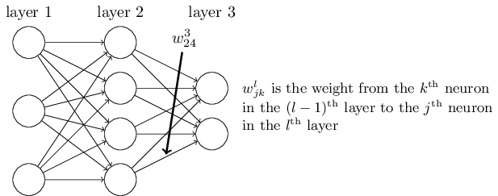
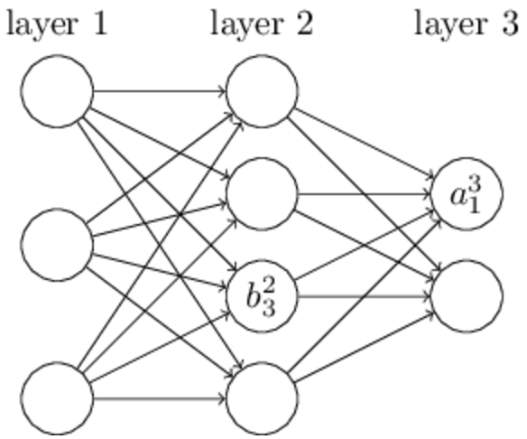

# Ch2 反向传播算法是如何工作的

在上一章中，我们看到了神经网络是如何用梯度下降来学习偏移量和权重的。不过我们并没有讲怎么去计算代价函数的梯度，而这一点其实还是很重要的。所以在本章中我们会讲一种计算梯度速度很快的算法，反向传播。

反向传播算法最初是在上个世纪70年代被发明的，但是直到[1986年的一篇著名的paper](http://www.nature.com/nature/journal/v323/n6088/pdf/323533a0.pdf)才让他得被人们重视起来，这个论文描述了一些神经网络，这些神经网络使用反向传播算法，可以得到比使用同时期的别的算法更快的速度，这就使得神经网络可以用来解决更加困难的问题。现在，反向传播已经成为了神经网络的基石。

本章会是本书中数学知识最多的一章，如果你不想看的话，你可以暂时的跳过本章，把反向传播算法当做是一个黑盒子。不过，为什么我们要去学习他呢？

因为，我们要用他来帮助我们理解神经网络。反向传播的核心是使计算代价函数的对于偏移量w的偏导$\partial C / \partial w$。这个表达式告诉我们，代价是如何跟随权重和偏移量改变的。这个表达式可能会有一点复杂，但是他也有优点的，其中的每一项都有它自己的直观的解释的。反向传播算法实际上告诉了我们网络改变权重和偏移量的行为。所以还是值得我们去好好看一下的。

话虽然这么说，但是如果你想要跳过本章，或者直接到往后的章节，这是没问题的，本书后续部分中可以把反向传播当做黑盒来看待。虽然后面有一些内容会引用本章的结果，但是如果你跳过本章的话其实也能理解那些地方的想法

## 热身：一个基于矩阵的快速计算神经网络输出的方法
在讨论反向传播之前，让我们通过一个基于矩阵的快速计算神经网络的输出的方法来进行一个热身。在上一章的结尾我们曾经简单的介绍过这个算法，不过我们讲的很粗略，所以还是有必要回顾一下的。而且在学习过程中使用熟悉的表达方式和上下文也是很有帮助的。

首先，让我们精确地表示一下权重，我们用$w^l_{jk}$来表示链接第l-1层的第k个神经元和第l层的第j个神经元的权重，比如下同中所表示的那个链接第二层的第四个神经元和第三层的第2个神经元的权重一样：

这种标记方法刚看起来确实是有点笨重的，而且需要一段时间才能掌握。但是当你掌握以后，你会发现这种表示方式还是很简单并且自然的。记号中的j,k的顺序是有点不自然，你也会想到用j表示输入的那个，k表示输出的那个会更合理，而不是现在这么别扭，不过后面我们会解释为什么这样更好。

我们用类似的方法来表示神经元的偏移量和激活值，详细一点就是$b^l_j$表示第l层的第j个神经元的偏移量，类似的$a^l_j$表示第l层的第j个神经元的激活值。下图是个例子：

通过这样的记号表示，第l层第j个神经元的激活值$a^l_j$是和他上一层的神经元的激活值有关系的（参考sigmoid方程，上一章中我们关于神经元的形式的讨论）可以得出：
$
\begin{eqnarray}
  a^{l}_j = \sigma\left( \sum_k w^{l}_{jk} a^{l-1}_k + b^l_j \right),
\tag{23}\end{eqnarray}
$
其中的求和是对所有的第l-1层的神经元k进行求和。为了将我们的表达式重写成矩阵形式，我们定义权重矩阵$w^l$表示第l层的权重。权重矩阵中的每一项都表示连接到第l层的神经元的权重，第j行第k列用$w^l_{jk}$表示第l-1层的第k个神经元到第l层的第k个神经元的权重。相似的，对于每一层l我们都会定义一个偏移量向量$b^l$，你应该也能猜出来，这个就表示第l层的所有神经元的偏移量，然后$b^l_j$表示的是第j个，同样的，我们会定义激活向量$a^l$。

在改写公式23的过程中，我们还差最后一步，就是函数的向量化。同样的，在上一章中我们曾经简单的介绍过函数向量化的内容，不过还是太粗略了，大概思路就是我们想要将一个函数比如$\sigma$作用到向量v的每一项上。我们使用一个简单的符号$\sigma (v)$来表示这种对于每个元素的自动应用。其实这个挺简单的就是$\sigma(v)_j = \sigma(v_j)$，举个栗子，假设我们有函数
$f(x) = x^2$，当我们对函数进行向量化后会得到下面的结果
$\begin{eqnarray}
  f\left(\left[ \begin{array}{c} 2 \\ 3 \end{array} \right] \right)
  = \left[ \begin{array}{c} f(2) \\ f(3) \end{array} \right]
  = \left[ \begin{array}{c} 4 \\ 9 \end{array} \right],
\tag{24}\end{eqnarray}$
就是向量化的函数f对向量中的每一项都进行了平方操作。
当我们记住了这些记号，标记以后，方程23就可以被改写成下面这个简单的样子了：
$
\begin{eqnarray}
  a^{l} = \sigma(w^l a^{l-1}+b^l).
\tag{25}\end{eqnarray}$

这个表达式让我们可以从一种更全面的角度去观察，观察某一层的神经元的激活值是如何的被上一层的神经元的激活值所影响的：我们将权重矩阵和上一层的激活值相乘，然后把偏移量加上去，再然后将sigmoid函数应用到这个值上(顺带提一句，这个地方就可以来解释我们上文中的那个jk顺序的疑惑，如果我们用j来表示输入神经元，k来表示输出神经元的话，那么我们就需要对上面的公式25的权重矩阵进行转换，这虽然是一个小小的改动，但是却有点烦人而且我们的表达就不这么优美，直观了。)

相对于一个神经元一个神经元的看，全局的视角通常会让事情变得更加的简单，简明(没有那么多的索引)。把这当做是逃离索引的地狱吧，我们仅仅留下一些简明的信息来标示。而且在实际工作中，这样的表达也是很有用的，因为大多数的关于矩阵计算的库提供了很多算法的快速实现，矩阵乘法，向量加法，还有向量化等等，上一章中的代码，其实也包含了这些方法。

当我们在使用公式25去计算$a^l$的时候，我们其实要先去计算$z^l \equiv w^l a^{l-1}+b^l$，我们称$z^l$是l层神经网络的加权输入在本章后面的内容中，我们会大量的使用$z^l$这个符号。公式25有的时候也会通过使用$z^l$来简写成$a^l = sigma(z^l)$，同样的，相对于把$z^l$拆分成$z^l_j
= \sum_k w^l_{jk} a^{l-1}_k+b^l_j$,(其中$z^l_j$表示第l层的第j个神经元的激活值的加权输入)用$z^l$明显更为简单。

## 关于代价函数的两个假设
反向传播是用来计算代价函数C关于网络中的权重和偏移量的偏导数$\partial C/ \partial w$和$\partial C / \partial b$的。为了让反向传播算法能够工作，我们需要做两个关于代价函数的假设。在开始陈述我们的假设之前，还是在脑海中存在一个例子会比较有帮助。我们使用上一章中的二次代价函数$\begin{eqnarray}  C(w,b) \equiv
  \frac{1}{2n} \sum_x \| y(x) - a\|^2 \nonumber\end{eqnarray}$当我们使用上一节的矩阵形式的表达后，我们的代价函数会变成下面的样子：
  $\begin{eqnarray}
  C = \frac{1}{2n} \sum_x \|y(x)-a^L(x)\|^2,
\tag{26}\end{eqnarray}$
这里，n表示训练样本的总数，和是对每个训练样本x进行求和，y=y(x)是与之相对应的期望输出，L表示的神经网络的层数$a^L = a^L(x)$是网络对于输入x的输出。

现在，让我们来看一下我们到底需要对于我们的代价函数C，做什么假设,来使得我们的反向传播算法可以应用。
第一个假设是我们的代价函数可以写成下面这样的形式:
$C = \frac{1}{n} \sum_x C_x$
其中$C_x$是每一个训练样本x的代价，对于二次代价函数来说这个假定是成立的。其实，这个对于我们本书后面会提到的别的代价函数也是成立的。

之所以我们需要这个假设是因为，反向传播算法实际上让我们对于每一个训练样本x分别求出$\partial C_x / \partial w$和$\partial C_x/ \partial b$，然后我们通过对所有的样本求平均值就可以求出$\partial C/ \partial w$和$\partial C/ \partial b$，基于这样的假设，其实我们就可以去掉C的下标了，将$C_x$记为C，其实，最后我们还是会把下标x放回去，但是现在加上下标挺麻烦的，所以，我们还是暂时先去掉比较好。

我们做的第二个假设是我们的代价函数可以写作是关于神经网络输出的函数：

这一点很好理解，因为我们的二次代价函数对于单一训练样本满足：
$\begin{eqnarray}
  C = \frac{1}{2} \|y-a^L\|^2 = \frac{1}{2} \sum_j (y_j-a^L_j)^2,
\tag{27}\end{eqnarray}
$
当然了，代价函数还是依赖于期望出y的，所以，你可能会好奇，为什么我们不把代价函数看作是期望输出y的函数呢？要记住，当我们确定了输入x以后那么他的期望输出y就是固定的，这个东西，并不是我们通过调整权重，偏移量就可以改变的，并不是神经网络所要学习的。所以还是将代价函数看作是神经网络的激活值的函数，把y当做是方程中的一个参数来看待比较合理。

## HADAMARD乘法 $s \odot t$
反向传播算法基于一些常规的线性代数的操作，就像向量加法，向量和矩阵相乘等等的，但是，也有呢么一些不是很常用的操作会被我们使用到。假设s和t是两个具有同样维数的向量，那么$s \odot t$就表示s和t中对应项相乘。也就是$(s \odot t)_j = s_j *t_j$。比如说：
$\begin{eqnarray}
\left[\begin{array}{c} 1 \\ 2 \end{array}\right]
  \odot \left[\begin{array}{c} 3 \\ 4\end{array} \right]
= \left[ \begin{array}{c} 1 * 3 \\ 2 * 4 \end{array} \right]
= \left[ \begin{array}{c} 3 \\ 8 \end{array} \right].
\tag{28}\end{eqnarray}$

这种应用在每一项上的乘法被称作hadamard乘法或者schur乘法。本书中，我们会称之为hadamard乘法。通常矩阵操作的库中会包含有hadamard乘法的实现，这在我们实现反向传播算法的时候会被使用到的。

## 反向传播背后的4个公式
反向传播算法是用来理解神经网络的代价函数是如何随着权重和偏移量的改变而改变的。本质上讲，其实就是计算$\partial C/ \partial w^l_{jk}$和$\partial C / \partial b^l_j$这两个偏导数的。不过，为了方便我们计算，首先要引入一个中间变量$\delta^l_j$,我们称这个中间变量为第l层的第j个神经元的“误差”，反向传播会给我们一个方法来计算误差$\delta ^l_j$并且将这个误差和$\partial C/ \partial w^l_{jk}$以及$\partial C / \partial b^l_j$关联起来。为了方便理解这个“误差”到底是什么，我们作如下的一个情景假设，想象一下，我们的网络中存在一个小😈：

这个小恶魔位于第l层的第j个神经元上。当数据输入到神经元时，小恶魔对这个神经元做了一些手脚，对原来的加权输入$z^l_j$做了$\Delta z^l_j$的改变，也就是说，这个时候，这个神经元的输出从$\sigma (z^l_j)$变成了$\sigma (z^l_j + \Delta z^l_j)$。然后这个小的改动会穿过后续的神经元，最后，对于代价函数有了影响，使得全局的代价函数发生改变，$\frac{\partial C}{\partial z^l_j} \Delta z^l_j$

如果这个😈是一个善良的😈，那么他会帮助你改进网络，也就是说，会找到一个$\Delta z^l_j$来减小代价函数的值。假设$\frac{\partial C}{\partial z^l_j}$是一个很大的值(暂且无论正负)。那么这个恶魔可移动过选择一个与$\frac{\partial C}{\partial z^l_j}$符号相反的值很小的$\Delta z^l_j$来降低代价函数的值，相反的，如果$\frac{\partial C}{\partial z^l_j}$很接近于0，那么小恶魔就不能通过对加权输入进行影响来改进代价的值了，也就是说，我们的小恶魔可以分辨这个神经元是不是已经足够的优化了，(这仅仅针对于$\Delta z^l_j$很小的情况下，我们会限制小恶魔只能做一些很微小的操作。)

通过这个小恶魔的故事，我们可以定义第l层的第j个神经元的错误$\delta ^l_j$如下：
$
\begin{eqnarray}
  \delta^l_j \equiv \frac{\partial C}{\partial z^l_j}.
\tag{29}\end{eqnarray}
$
和我们之前说的那样，我们使用$\delta ^l$来表示整个第l层的误差向量。反向传播算法给我们了一个计算每一层的误差$\delta^l$的方法，然后我们就可以根据这些误差去计算$\partial C / \partial w^l_{jk}$和$\partial C / \partial b^l$。

你可能会好奇，为什么这个恶魔会选择改变加权输入$z^l_j$。当然了，如果我们想象恶魔直接改变神经元的输出--该神经元的激活值$a^l_j$，会更加自然，这样我们就可以使用$\frac{\partial C}{\partial a^l_j}$来衡量网络的误差。实际上，如果你这么去考虑的话，得到的结论会和我们下面的结论很像，但是会让我们的代数表达变得有点复杂，所以我们就还是用$\delta^l_j = \frac{\partial C}{\partial z^l_j}$来衡量我们的’误差’。(在进行分类问题，类似于MNIST时，’错误’项有时候意味着分类的错误率。比如神经网络的分类中百分之九十六的数据是正确的，那么就意味着有百分之4的是错误的，显然这和我们的$\delta$向量是有很大的区别的，实际上，你并不需要去焦虑，通常都是会有上下文帮助你理解的。)

Plan of attack:反向传播算法是基于四个方程的。这些方程在一起，帮助我们计算误差$\delta$和代价函数的梯度。下面，我会介绍这4个方程，但是要说明的是，你可能不会立刻接受理解这四个方程，可能会遇到点小挫折，实际上反向传播方程含有很多的信息，想要理解他们是需要时间去思考的，逐渐的去深入理解的。不过在后面我们会反复的进行讨论和练习来帮助你去理解，本节中仅仅是一个开始。

在本章中，我们是这么打算的，首先我们会给出一个短的证明，以此来解释为什么我们的方程式正确的，然后我们会以伪代码的形式，用讲解算法的方法去讲解这些方程，并且会看到我们如何用python来实现这个伪代码所表达的算法，在本章的最后，我们会建立一个直观的场景，来看看反向传播方程究竟意味着什么，人们是怎么去发现他的。最后我们会再回过头看着四个方程，你可能就会理解的更加深入，觉得他们还是很棒的的。

### 第一个方程是有关输出层的’误差’$\delta^L$。
他的数学计算如下:
$\begin{eqnarray}
  \delta^L_j = \frac{\partial C}{\partial a^L_j} \sigma'(z^L_j).
\tag{BP1}\end{eqnarray}$
这是一个很自然的表达式，方程右边的第一项$\partial C / \partial a^L_j$，仅仅是用来衡量我们的代价函数是如何随着第j个神经元的激活值而改变的。比如说，如果C并不很依赖于第j个输出神经元,那么就会很小，这是我们所期望的，方程右侧的第二项$\sigma'(z^L_j)$，表示激活值随着这个神经元的加权输入$Z^L_j$改变的速度。

要注意的是BP1中的每部分都很容易去计算，实际上，我们在计算网络行为的同时，就会计算出$Z^L_j$，而且，仅需一点额外计算量，就可以得到$\sigma'(Z^L_j)$。$\partial C / \partial a^L_j$的具体情况依赖于代价函数C的形式，不过，这并没有很麻烦，比如我们的代价函数为二次代价函数$C = \frac{1}{2} \sum_j (y_j-a_j)^2$时那么$\partial C / \partial a^L_j = (a_j-y_j)$。这个计算还是很简单的。

等式BP1是$\sigma^L$的一个分项的表达式。这是一个好的形式，但是并不是我们所希望的那种整体的矩阵表达的形式，将它改成矩阵表达的形式也很简单：
$\begin{eqnarray}
  \delta^L = \nabla_a C \odot \sigma'(z^L).
\tag{BP1a}\end{eqnarray}$
这里，$\nabla_a C$是一个向量，其中的元素（每一项）是$\partial C / \partial a^L_j$。你可以将它当做是代价函数C根据输出的激活值的改变的速率。我们很简单就能看出等式BP1和BP1a是等价的，所以，从现在起我们将使用BP1来代指这两个公式。对于我们的二次代价函数来说，他的BP1的完全的矩阵表达形式就是：
$\sigma^L = (a^L - y)\odot \sigma'(z^L)$
你可以看到，本式中的每一项都是非常好的向量形式($a^L$表示的是最后一层的激活值是一个向量，y是对应的期望输出，是一个向量，$z^L$表示的是本层的加权输入，同样是一个向量)，这就让我们很容易用Numpy去计算这个表达式了。

### 使用l+1层的误差$\sigma^{l+1}$来计算l层的误差$\sigma^l$
数学表达式如下：
$\begin{eqnarray}
  \delta^l = ((w^{l+1})^T \delta^{l+1}) \odot \sigma'(z^l),
\tag{BP2}\end{eqnarray}$
这里的$(w^{l+1})^T $表示的是第l+1层的权重矩阵的转置。这个方程看起来有点复杂，但其实，其中的每一项都很好去理解。假设我们知道了第l+1层的误差$\sigma^{l+1}$,那么当我们使用$(w^{l+1})^T $乘以这个误差的时候，我们就可以认为是这个错误反向的通过了这个网络，那么我们就得到了计算第l层的误差$\sigma^l$的条件(看到这里你可能有点迷惑，不过别着急，先试着想一下，稍后介绍完4个公式我们会对这四个公式进行证明的)。然后我们使用hadamard乘积$\odot \sigma'(z^l)$。这样让我们的误差就反向的通过了第l层的激活函数，给了我们关于第l层的加权输入的误差$\sigma^l$。

通过结合BP1和BP2我们就可以计算网络中任何一层的错误。首先，我们使用BP1去计算第L层的错误，然后通过BP2去计算第L-1层的，然后再次去计算第L-2层的，直到我们这样一层层的反向穿过整个网络。

### 如果我们用偏移量来表达网络代价值的改变速度的话我们就有：
$\begin{eqnarray}  \frac{\partial C}{\partial b^l_j} =
  \delta^l_j.
\tag{BP3}\end{eqnarray}$
这里，我们惊奇的发现了$\delta ^l_j$和$\partial C/ \partial b^l_j$是一样的。

这真是一个很好的消息呢（为什么好呢，请回想一下梯度下降中的梯度），因为通过B如何计算P1和BP2我们已经知道了如何计算$\delta ^l_j$，我们现将BP3简化的写一下就是：
$\begin{eqnarray}
  \frac{\partial C}{\partial b} = \delta,
\tag{31}\end{eqnarray}$
不过，需要说明的是，$\delta$和偏移量$b$指的是针对于同一个神经元的。

### 网络中某一权重对于代价函数的值的改变的影响：
$\begin{eqnarray}

  \frac{\partial C}{\partial w^l_{jk}} = a^{l-1}_k \delta^l_j.
\tag{BP4}\end{eqnarray}$
这里我们得到了如何通过$\delta^l$和$a^{l-1}$去计算偏导$\partial C / \partialw^l_{jk}$,而这里的$\delta^l$和$a^{l-1}$使我们已知的，如果我们简化一下表达式：
$\begin{eqnarray}  \frac{\partial
    C}{\partial w} = a_{\rm in} \delta_{\rm out},
\tag{32}\end{eqnarray}$
这里结合上一个公式，你可以看出$a_{in}$l-1层的第k个神经元的激活值，对应的也就是$w^l_{jk}$这个权重的输入，$\sigma out$指的是第l层的第j个神经元的误差（回想一下在前面的时候我们的那个小恶魔创造的错误是什么？是作用在加权输入上的，所以这里你能明白么？）。我们用图来表达一下：

等式32的特点就是当$a_{in}$变得很小的时候，接近于0的时候，那么，梯度项$\partial C/ \partial w$，同样会变得很小。在这种情况下，我们说权重学习的很慢，也就是意味着在梯度下降期间，我们的权重并不会有太大的改变。换言之，当我们参看BP4的时候，可以看的出对于那些激活值比较低的神经元的输出对应的到下一层的权重学习速度很慢。

从BP1到BP4中我们还可以得到其他的直观的概念。首先，让我们看一下输出层。我们看一下BP1中的$\sigma'(z^L_j)$，我们回想一下上一章中的，关于sigmoid函数的函数图像：

当函数值很接近于0或者1的时候，函数图像会变得很平滑。当这种情况发生的时候我们可以观察到$\sigma'(z^L_j) \approx 0$也就是说，最后一层的神经元在激活值很高或是很低的时候，权重的学习就会变得很慢（其实偏移量也一样，不过权重在网络中往往更多更重要，所以有的时候我们会将更多的注意力放在权重上）。在这种情况下，我们通常会说输出神经元饱和(saturated)了，同时，权重的学习也停止了(或者变得很慢了)。这个情况对于偏移量学习也一样存在。

除了最后一层的神经元，整个网络中别的神经元上我们都可以观察到类似的行为。回想一下BP2其中有一项$\sigma'(z^l)$。我们同样可以看到当神经元趋近于饱和的情况下，BP2的值会变小。也就是说，所有神经元的权重学习都会在神经元接近饱和态时速度放缓。(不过，当$(w^{l+1})\delta^{l+1}$足够大的时候，其实完全可以弥补$\sigma'(z^l)$很小的带来的影响，不过这属于极端情况，我们还是先来看一些普通的情况吧。)

总结一下，当输入神经元的激活值很低或者输出神经元达到饱和状态（低或者高的激活值时）权重的学习就会变得很慢。

我们所观察到的这些行为好像没有那么的，，surprise。然而，他们还是可以帮助我们改进模型，帮助我们更加了解神经网络的发展，学习的。而且，我们可以把这些推广开来。这四个基本公式其实是适用于所有的激活函数的，并不是只有标准的sigmoid函数（因为我们回顾一下，在证明和阐述中，我们并没有使用到任何有关σ的特性）。并且，我们还可以使用这四个基本公式去设计具有特定的学习属性的激活函数。我们举个栗子帮你去开拓一下思维，假设，我们选择了一个sigmoid以外的函数作为激活函数$\sigma$，并且他的导数$\sigma'$永远是正数，还永远也不会接近零。那这样神经元的学习速度就不会减缓——sigmoid神经元饱和的时候发生的情况。本书的后面我们会看到一些其他的激活函数，不过我们需要要记住下面这四个公式，他们会帮助你理解为什么我们会选择这些神经元，以及这些神经元之间不同的性质会对我们的工作带来什么影响。

## 小提示
变换反向传播公式的表达：我们在之前已经陈述过通过hadamard乘积来表示反向传播公式，主要是在BP1和BP2中。

当你对于hadamard乘积并不熟悉的时候，这些公式可能会让你觉得难以理解，这里有一个别的方法的方法，基于传统的矩阵乘法，对于一些人可能会有所启发。BP1$\begin{eqnarray}
\delta^L_j = \frac{\partial C}{\partial a^L_j} \sigma'(z^L_j) \nonumber\end{eqnarray}$可以被重写成：
$\begin{eqnarray}
    \delta^L = \Sigma'(z^L) \nabla_a C,
  \tag{33}\end{eqnarray}$
这里$\Sigma'(z^L)$是一个方阵，他的斜对角线是$\sigma'(z^L_j)$别的元素都是0。这个结果会和$\nabla_a C$按照传统的矩阵乘法相乘。

按照同样的规则，BP2就可以被重写成：
$\begin{eqnarray}
    \delta^l = \Sigma'(z^l) (w^{l+1})^T \delta^{l+1}.
  \tag{34}\end{eqnarray}$
然后重新组合一下这两个方程我们就可以得到任意一层的误差：
$\begin{eqnarray}
    \delta^l = \Sigma'(z^l) (w^{l+1})^T \ldots \Sigma'(z^{L-1}) (w^L)^T
    \Sigma'(z^L) \nabla_a C
  \tag{35}\end{eqnarray}$
对于熟悉传统方法的人来说，这个表达可能看起来会更加友好，不过，我们还是会使用BP1和2的方式，因为它会带来更高效的计算。
